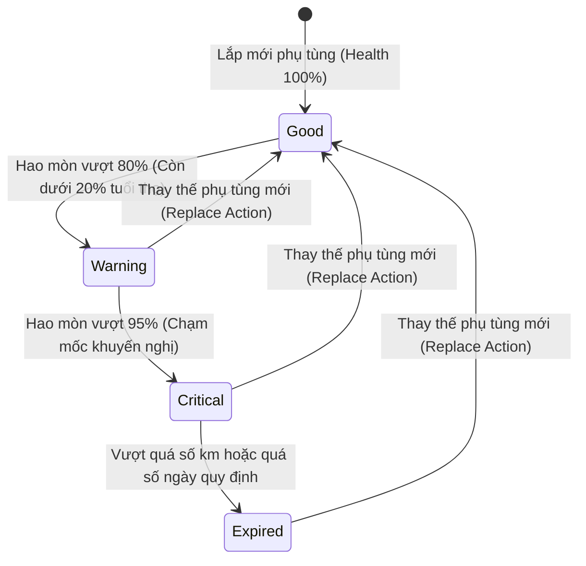

# Kế Hoạch Triển Khai: Quản Lý Chu Kỳ Hao Mòn Linh Kiện & Tuổi Thọ Phụ Tùng (Component Lifecycle Management)

## 1. Tổng Quan & Giá Trị Thực Tế
* **Bài toán thực tế:** Xe máy không chỉ có mỗi việc "thay nhớt máy". Mỗi bộ phận (lọc gió, bugi, dây curoa, nhông sên dĩa, má phanh, nước làm mát, ắc quy...) có tốc độ hao mòn và chu kỳ thay thế hoàn toàn khác nhau. Việc không nắm được tình trạng các bộ phận này dẫn đến xe hỏng vặt dọc đường, tiêu hao nhiên liệu hoặc nguy hiểm khi phanh mòn.
* **Giải pháp:**
  * **Template cấu hình phụ tùng theo loại xe:** Tự động tạo danh mục kiểm tra phù hợp (Xe tay ga, Xe số, Xe côn tay, Xe mô tô PKL).
  * **Thước đo sức khỏe linh kiện trực quan (% Health Score):** Hiển thị thanh tiến trình từ 100% (mới thay) giảm dần về 0% (quá hạn thay thế).
  * **Quản lý hạn bảo hành phụ tùng:** Nhắc nhở khi ắc quy, lốp xe hoặc phụ tùng đắt tiền sắp hết hạn bảo hành từ cửa hàng.

---

## 2. Thiết Kế Cơ Sở Dữ Liệu (Database Schema)
> [!IMPORTANT]
> **Quy tắc dự án:** Tuyệt đối không dùng foreign key constraints (`constrained()`, `foreign()`, `references()`). Dùng `unsignedBigInteger` cho các cột liên kết.

### 2.1. Bảng `component_templates` (Danh mục mẫu của nhà sản xuất)
* `id` (`bigIncrements`)
* `bike_type` (`string`): Loại xe (`scooter`, `manual`, `underbone_clutch`, `sport_cruiser`).
* `component_key` (`string`): Mã định danh (`engine_oil`, `gear_oil`, `spark_plug`, `air_filter`, `coolant`, `brake_pad_front`, `brake_pad_rear`, `drive_belt`, `sprocket_chain`, `battery`, `front_tire`, `rear_tire`).
* `name_vi` (`string`): Tên tiếng Việt (Ví dụ: "Dây curoa truyền động").
* `default_interval_km` (`unsignedInteger`, nullable): Chu kỳ khuyến nghị theo km (Ví dụ: 20.000).
* `default_interval_days` (`unsignedInteger`, nullable): Chu kỳ khuyến nghị theo ngày (Ví dụ: 730 ngày).
* `warning_threshold_pct` (`unsignedTinyInteger`, default: 85): Ngưỡng cảnh báo màu vàng (% hao mòn).
* `description` (`text`, nullable): Tác dụng và dấu hiệu hư hại.
* `timestamps`

### 2.2. Bảng `bike_components` (Linh kiện gắn liền với từng xe cụ thể)
* `id` (`bigIncrements`)
* `bike_id` (`unsignedBigInteger`): Liên kết đến xe.
* `component_key` (`string`): Mã linh kiện.
* `custom_name` (`string`): Tên hiển thị (Ví dụ: "Nhớt Motul 300V 10W40").
* `specifications` (`string`, nullable): Thông số kỹ thuật (Ví dụ: "0.8L, chân bugi ngắn CPR8").
* `installed_odo` (`unsignedInteger`): Mốc ODO lúc lắp vào xe.
* `installed_date` (`date`): Ngày lắp vào xe.
* `interval_km` (`unsignedInteger`, nullable): Chu kỳ km áp dụng riêng cho linh kiện này.
* `interval_days` (`unsignedInteger`, nullable): Chu kỳ ngày áp dụng riêng cho linh kiện này.
* `warranty_months` (`unsignedTinyInteger`, default: 0): Số tháng bảo hành.
* `warranty_expiry_date` (`date`, nullable): Ngày hết hạn bảo hành.
* `status` (`enum`: `good`, `warning`, `critical`, `expired`): Trạng thái sức khỏe.
* `notes` (`text`, nullable): Ghi chú của chủ xe/thợ.
* `timestamps`

### 2.3. Bảng `bike_component_histories` (Lịch sử thay thế phụ tùng)
* `id` (`bigIncrements`)
* `bike_id` (`unsignedBigInteger`)
* `component_key` (`string`)
* `old_part_name` (`string`, nullable)
* `new_part_name` (`string`)
* `replaced_odo` (`unsignedInteger`)
* `replaced_date` (`date`)
* `cost` (`unsignedDecimal:12,2`, default: 0)
* `garage_name` (`string`, nullable)
* `receipt_image_path` (`string`, nullable)
* `notes` (`text`, nullable)
* `timestamps`

---

## 3. Thiết Kế Logic Nghiệp Vụ & API Endpoints

### 3.1. Công thức tính % Tuổi thọ linh kiện (Health Percentage)
Tại một thời điểm với ODO hiện tại $ODO_{cur}$ và Ngày hiện tại $Date_{cur}$:
* **Theo khoảng cách Km:**
$$Wear_{km} = \frac{ODO_{cur} - ODO_{installed}}{Interval_{km}} \times 100\%$$
* **Theo khoảng cách Ngày:**
$$Wear_{days} = \frac{Date_{cur} - Date_{installed}}{Interval_{days}} \times 100\%$$
* **Mức độ hao mòn thực tế:**
$$Wear_{actual} = \max(Wear_{km}, Wear_{days})$$
* **Điểm sức khỏe (Health Score):**
$$Health = \max(0, 100 - Wear_{actual})$$

*Quy tắc đổi màu trạng thái:*
* $Health > 20\%$: Trạng thái `good` (Xanh lá).
* $5\% \le Health \le 20\%$: Trạng thái `warning` (Vàng / Cần lưu ý chuẩn bị thay).
* $Health < 5\%$: Trạng thái `critical` (Đỏ / Quá hạn khuyến nghị).

### 3.2. Danh Sách API Endpoints
* `GET /api/bikes/{bikeId}/components`: Lấy toàn bộ danh sách linh kiện của xe kèm điểm sức khỏe `health_percentage` và trạng thái `status`.
* `POST /api/bikes/{bikeId}/components/apply-template`: Khởi tạo nhanh linh kiện theo template loại xe (Scooter / Manual / Clutch).
* `POST /api/bikes/{bikeId}/components`: Thêm mới một linh kiện cần theo dõi riêng biệt (ví dụ đồ chơi xe, phuộc xe độ).
* `POST /api/bikes/{bikeId}/components/{id}/replace`: Đánh dấu đã thay mới phụ tùng này -> Chuyển linh kiện cũ vào `bike_component_histories`, reset mốc `installed_odo = current_odo` và `installed_date = today`.
* `PUT /api/bikes/{bikeId}/components/{id}`: Điều chỉnh thông số chu kỳ (ví dụ đổi loại nhớt cao cấp cho phép chạy 3.000 km thay vì 1.500 km).

---

## 4. Sơ Đồ Trạng Thái Vòng Đời Linh Kiện (State Diagram)

---

## 5. Đặc Tả Use Case Chi Tiết Phục Vụ Kiểm Thử

### UC-COMP-01: Khởi tạo linh kiện theo loại xe (Apply Template)
* **Actor:** Chủ xe.
* **Pre-condition:** Xe vừa được đăng ký, xác định là dòng `scooter` (Xe tay ga, ví dụ: Honda Lead / Air Blade).
* **Main Flow:**
  1. Người dùng chọn tính năng "Khởi tạo danh sách linh kiện".
  2. Hệ thống đọc từ `component_templates` cho `scooter`.
  3. Hệ thống tự động tạo 8 linh kiện tiêu chuẩn: Nhớt máy (2.000 km), Nhớt hộp số (6.000 km), Lọc gió (10.000 km), Dây curoa (20.000 km), Bố ba càng/Bi nồi (15.000 km), Bugi (10.000 km), Nước làm mát (20.000 km), Má phanh (12.000 km).
  4. Hệ thống gán `installed_odo = bike.current_odo`.
* **Post-condition:** Toàn bộ linh kiện hiển thị thanh trạng thái màu xanh (100% Health).

### UC-COMP-02: Thay thế linh kiện & Chuyển dịch lịch sử (Replace Component)
* **Actor:** Chủ xe hoặc Thợ kỹ thuật.
* **Pre-condition:** Linh kiện "Lọc gió" đang ở trạng thái `critical` (Health 2%).
* **Main Flow:**
  1. Người dùng bấm nút "Ghi nhận thay mới" tại mục "Lọc gió".
  2. Người dùng nhập: Tên lọc gió mới ("Lọc gió zin Honda"), ODO lúc thay (10.200 km), Chi phí (145.000 VND), Gara thực hiện ("Honda Head"). Đính kèm ảnh chụp hóa đơn.
  3. Hệ thống tạo bản ghi mới vào `bike_component_histories`.
  4. Hệ thống cập nhật bản ghi trong `bike_components`: `installed_odo = 10200`, `installed_date = today`, `health_percentage = 100%`, `status = good`.
* **Post-condition:** Mục "Lọc gió" trở lại màu xanh, lịch sử xe được cộng dồn chi phí 145.000 VND.

### UC-COMP-03: Cảnh báo bảo hành linh kiện (Warranty Expiration Alert)
* **Actor:** Hệ thống (Cron job hàng ngày).
* **Pre-condition:** Linh kiện "Bình ắc quy GS" có `warranty_expiry_date = 10/10/2026`.
* **Main Flow:**
  1. Đến ngày `03/10/2026` (còn 7 ngày trước khi hết hạn bảo hành).
  2. Hệ thống kiểm tra điều kiện bảo hành.
  3. Hệ thống gửi thông báo: *"Bình ắc quy xe của bạn sắp hết hạn bảo hành vào ngày 10/10/2026. Hãy kiểm tra nếu có dấu hiệu đề yếu để được bảo hành kịp thời"*.

---

## 6. Ma Trận Kịch Bản Kiểm Thử (Test Cases Matrix)

| Test ID | Tên Kịch Bản | Dữ Liệu Đầu Vào | Kỳ Vọng Kết Quả | Phân Loại |
| :--- | :--- | :--- | :--- | :--- |
| **TC-CMP-01** | Tính Health theo Km chính xác | Lắp ODO 10.000 km, Interval 10.000 km, ODO hiện tại 15.000 km | Hao mòn 50%, Health = 50%, Status = `good`. | Calculation |
| **TC-CMP-02** | Chuyển trạng thái sang `warning` | Lắp ODO 10.000 km, Interval 10.000 km, ODO hiện tại 18.200 km | Hao mòn 82% (> 80%), Status chuyển thành `warning`. | State Check |
| **TC-CMP-03** | Chuyển trạng thái sang `critical` | ODO hiện tại 19.600 km (Hao mòn 96%) | Health = 4%, Status chuyển thành `critical`. | State Check |
| **TC-CMP-04** | Hao mòn vượt mốc 100% | ODO hiện tại 21.000 km (quá 1.000 km) | Health = 0% (không âm), Status = `expired`. | Boundary Test |
| **TC-CMP-05** | Ưu tiên điều kiện tới hạn lớn hơn giữa Km và Ngày | Dây curoa mới đi 5.000 km (25%) nhưng đã lắp 3 năm (Interval 2 năm = 150%) | Health lấy theo Ngày = 0%, Status = `expired`. | Dual Rule |
| **TC-CMP-06** | Reset vòng đời khi thay thế linh kiện | Thực hiện thay mới linh kiện đang `expired` | Linh kiện quay về 100% Health, log lịch sử tạo thành công với đúng số tiền và ODO. | Flow Integrity |
| **TC-CMP-07** | Template đặc thù cho xe côn tay / xe số | Chọn khởi tạo cho dòng `manual` | Không có các mục `drive_belt` (dây curoa), thay bằng `sprocket_chain` (nhông sên dĩa). | Business Data |

---

## 7. Kế Hoạch Triển Khai
1. Tạo migration `component_templates`, `bike_components`, `bike_component_histories` (no foreign keys).
2. Tạo Seeder dữ liệu chuẩn của Honda/Yamaha cho các dòng xe phổ thông (Wave Alpha, Air Blade, Vision, Exciter, Winner X).
3. Triển khai Service tính toán `ComponentHealthCalculatorService`.
4. Viết Feature Test cho API thay thế linh kiện và reset tiến độ.
