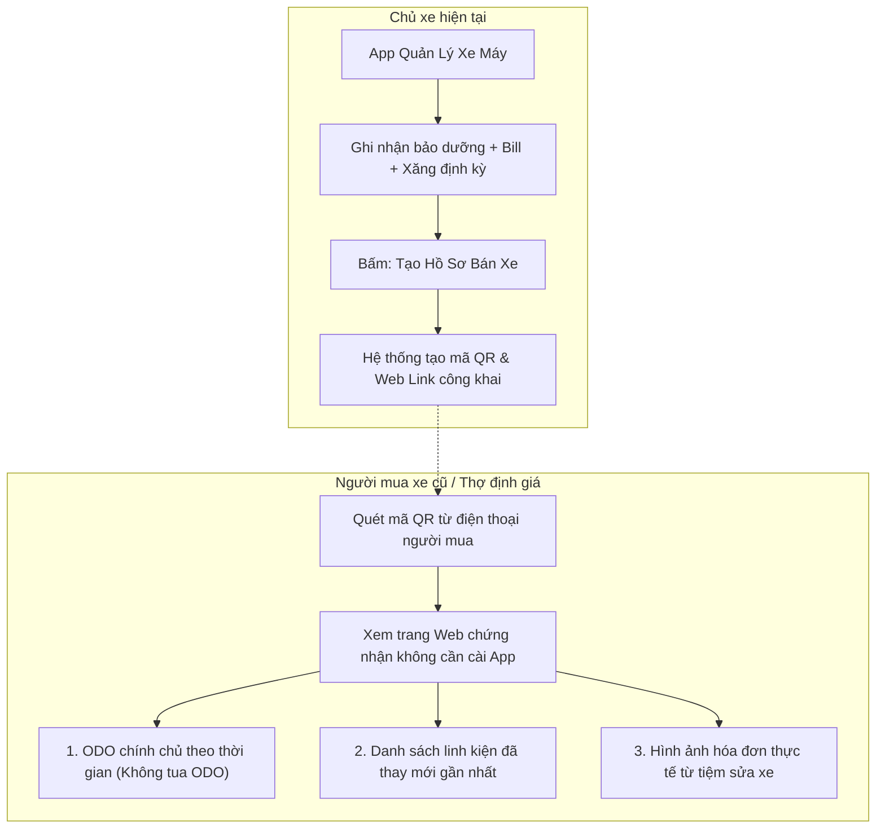

# Kế Hoạch Triển Khai: Sổ Bảo Dưỡng Điện Tử, Chi Phí Vận Hành (TCO) & Xuất Báo Cáo Xe Cũ (Digital Logbook & Resale Passport)

## 1. Tổng Quan & Giá Trị Thực Tế
* **Bài toán thực tế:**
  1. **Mất giá khi bán lại xe cũ:** Thị trường mua bán xe máy cũ tại Việt Nam tràn ngập xe bị tua ODO, luộc đồ hoặc tai nạn. Người chăm xe cẩn thận không có bằng chứng xác thực để chứng minh chất lượng xe, dẫn đến bị ép giá.
  2. **Mù mờ về chi phí nuôi xe:** Chủ xe không nắm được mỗi tháng tốn bao nhiêu tiền xăng, xe đi hao xăng bao nhiêu (Lít/100 km), tổng tiền sửa chữa trong năm là bao nhiêu để quyết định tiếp tục đi hay đổi xe mới.
* **Giải pháp:**
  * **Hồ sơ sức khỏe xe điện tử (Digital Service Passport):** Lưu vết toàn bộ các đợt bảo dưỡng, sửa chữa, thay thế phụ tùng kèm hình ảnh và hóa đơn chứng minh.
  * **Phân tích Tổng chi phí sở hữu (TCO - Total Cost of Ownership):** Theo dõi tiền xăng, tiền bảo dưỡng, tiền sửa chữa, phí bảo hiểm bắt buộc... Tính toán chi phí trung bình trên mỗi km vận hành (VND/km).
  * **Chia sẻ báo cáo công khai (Public QR / Web Link / PDF):** Cho phép tạo liên kết xem trực tiếp lịch sử chăm sóc xe dành cho người mua xe cũ mà không yêu cầu cài ứng dụng.

---

## 2. Thiết Kế Cơ Sở Dữ Liệu (Database Schema)
> [!IMPORTANT]
> **Quy tắc dự án:** Tuyệt đối không dùng foreign key constraints (`constrained()`, `foreign()`, `references()`). Dùng `unsignedBigInteger` cho các cột liên kết.

### 2.1. Bảng `fuel_logs` (Nhật ký đổ xăng)
* `id` (`bigIncrements`)
* `bike_id` (`unsignedBigInteger`): Liên kết đến xe.
* `logged_date` (`date`): Ngày đổ xăng.
* `odometer` (`unsignedInteger`): Số ODO tại thời điểm đổ xăng.
* `liters` (`unsignedDecimal:6,2`): Số lít xăng.
* `price_per_liter` (`unsignedDecimal:10,2`, nullable): Đơn giá xăng/lít.
* `total_amount` (`unsignedDecimal:12,2`): Tổng tiền trả.
* `is_full_tank` (`boolean`, default: true): Đánh dấu có đổ đầy bình không (cần thiết để tính chính xác Lít/100km).
* `notes` (`string`, nullable): Cây xăng, ghi chú.
* `timestamps`

### 2.2. Bảng `bike_public_reports` (Cấu hình liên kết chia sẻ công khai)
* `id` (`bigIncrements`)
* `bike_id` (`unsignedBigInteger`)
* `uuid_token` (`string`, unique): Mã hash duy nhất cho link công khai (Ví dụ: `a9f2-8c11-4b2e...`).
* `is_enabled` (`boolean`, default: true): Bật hoặc tạm khóa link xem xe.
* `show_costs` (`boolean`, default: false): Tùy chọn ẩn số tiền sửa chữa nếu chỉ muốn người mua xem lịch sử kỹ thuật.
* `show_receipt_images` (`boolean`, default: true): Cho phép xem ảnh hóa đơn thật.
* `view_count` (`unsignedInteger`, default: 0): Số lượt người đã quét xem.
* `expires_at` (`timestamp`, nullable): Thời hạn hiệu lực của link (mặc định 30 ngày).
* `timestamps`

---

## 3. Thiết Kế Logic Nghiệp Vụ & Chỉ Số Đo Lường

### 3.1. Thuật toán đo mức tiêu hao nhiên liệu (Fuel Consumption)
Chỉ tính toán giữa 2 lần đổ **đầy bình (full tank)** liên tiếp:
$$LitersPer100Km = \frac{Liters_{lần\_sau}}{(ODO_{lần\_sau} - ODO_{lần\_trước})} \times 100$$
$$KmPerLiter = \frac{ODO_{lần\_sau} - ODO_{lần\_trước}}{Liters_{lần\_sau}}$$

### 3.2. Chỉ số chi phí sở hữu (TCO)
* **Tổng chi phí (Total Cost):**
$$TCO = \sum \text{Tiền Xăng} + \sum \text{Tiền Bảo Dưỡng} + \sum \text{Tiền Phụ Tùng} + \sum \text{Chi Phí Khác}$$
* **Chi phí trên mỗi km lăn bánh (Cost Per Km):**
$$CPK = \frac{TCO}{ODO_{cuối} - ODO_{đầu}} \quad (\text{VND / km})$$

### 3.3. Danh Sách API Endpoints
* `POST /api/bikes/{bikeId}/fuel-logs`: Ghi nhận 1 lần đổ xăng (đồng thời cập nhật ODO xe nếu ODO lớn hơn ODO hiện tại).
* `GET /api/bikes/{bikeId}/fuel-logs`: Danh sách các lần đổ xăng và lịch sử tiêu hao (L/100km).
* `GET /api/bikes/{bikeId}/tco-summary`: Lấy báo cáo phân rã chi phí theo tháng/năm, chi phí theo từng nhóm phụ tùng.
* `POST /api/bikes/{bikeId}/public-report`: Sinh mã link chia sẻ công khai và tạo mã QR.
* `GET /api/public/bike-report/{uuid}`: **Public API** (không cần đăng nhập) dành cho người mua xe kiểm tra nguồn gốc lịch sử xe.
* `GET /api/bikes/{bikeId}/export-pdf`: Xuất file PDF "Sổ bảo dưỡng điện tử" định dạng in ấn khổ A4.

---

## 4. Sơ Đồ Kiến Trúc Báo Cáo Xe Cũ (Public Digital Passport)

---

## 5. Đặc Tả Use Case Chi Tiết Phục Vụ Kiểm Thử

### UC-TCO-01: Ghi nhận đổ xăng & Đo mức ăn xăng (Fuel Tracking)
* **Actor:** Chủ xe.
* **Pre-condition:** Đã có lần đổ đầy bình thứ nhất tại ODO 10.000 km.
* **Main Flow:**
  1. Người dùng vào đổ xăng lần 2, chọn đầy bình (Full tank).
  2. Người dùng nhập: ODO = 10.250 km, Số lít = 5.2 lít, Tiền = 120.000đ.
  3. Hệ thống tính quãng đường: $10.250 - 10.000 = 250\text{ km}$.
  4. Mức tiêu thụ tính được: $\frac{5.2}{250} \times 100 = 2.08\text{ Lít/100 km}$ ($\approx 48.07\text{ km/Lít}$).
  5. Hệ thống lưu vào bảng `fuel_logs` và cập nhật ODO của xe lên `10250`.
* **Post-condition:** Hiển thị biểu đồ tiêu hao nhiên liệu của xe.

### UC-TCO-02: Xem Dashboard phân rã chi phí vận hành (TCO Analytics)
* **Actor:** Chủ xe.
* **Main Flow:**
  1. Người dùng chọn mục "Báo cáo chi phí" -> Chọn khoảng thời gian "Năm 2026".
  2. Hệ thống tổng hợp:
     * Tiền xăng: 4.800.000đ (60%)
     * Tiền thay nhớt & lọc: 1.200.000đ (15%)
     * Tiền thay lốp & truyền động: 2.000.000đ (25%)
     * Tổng cộng: 8.000.000đ cho quãng đường 8.000 km.
     * Chi phí vận hành trung bình: 1.000đ / km.
* **Post-condition:** Hiển thị biểu đồ hình tròn phân bổ chi phí rõ ràng.

### UC-TCO-03: Chia sẻ hồ sơ xe cho người mua xe cũ (Public Share Passport)
* **Actor:** Chủ xe & Người mua xe.
* **Main Flow:**
  1. Chủ xe bấm "Chia sẻ hồ sơ bảo dưỡng".
  2. Chọn các tùy chọn: Cho phép xem ảnh hóa đơn, Ẩn số tiền chi tiết.
  3. Hệ thống tạo một URL dạng: `https://bike-parts.local/passport/a9f2-8c11-4b2e` và tạo ảnh mã QR tương ứng.
  4. Người mua quét mã QR trên điện thoại cá nhân (không cần đăng nhập tài khoản).
  5. Màn hình web hiển thị thông tin xe: Hãng xe, Dòng xe, Biển số, Lịch sử thay thế phụ tùng từ ngày mua, biểu đồ tăng trưởng ODO liên tục theo thời gian (chứng minh xe không bị tua ODO).
* **Alternative Flow:**
  * Chủ xe tắt chế độ chia sẻ (`is_enabled = false`): Người mua truy cập link sẽ thấy thông báo *"Hồ sơ xe này hiện không được chia sẻ công khai"*.

---

## 6. Ma Trận Kịch Bản Kiểm Thử (Test Cases Matrix)

| Test ID | Tên Kịch Bản | Dữ Liệu Đầu Vào | Kỳ Vọng Kết Quả | Phân Loại |
| :--- | :--- | :--- | :--- | :--- |
| **TC-TCO-F01** | Tính mức ăn xăng với 2 lần Full Tank | Lần 1: 10.000 km. Lần 2: 10.200 km, 4.0 Lít | Kết quả: `2.00 L/100km` (`50 km/L`). | Calculation |
| **TC-TCO-F02** | Đổ xăng không đầy bình (Partial Fill) | Đánh dấu `is_full_tank = false` | Lưu số tiền chi phí nhưng không tính chỉ số tiêu hao cho lần này. | Business Rule |
| **TC-TCO-F03** | ODO đổ xăng nhỏ hơn ODO lần trước | Lần 1: 10.000 km. Lần 2: 9.900 km | Báo lỗi validation 422 "Số ODO phải lớn hơn lần đổ xăng trước". | Edge Case |
| **TC-TCO-P01** | Tạo link công khai thành công | Request share report với `show_costs = false` | Tạo `uuid_token`, trả về link và QR code. | Happy Path |
| **TC-TCO-P02** | Truy cập link công khai không cần Token đăng nhập | Gửi request `GET /api/public/bike-report/{uuid}` không Bearer Token | HTTP 200 OK, trả về thông tin xe và lịch sử bảo dưỡng. | Authorization |
| **TC-TCO-P03** | Tùy chọn ẩn giá tiền hoạt động chính xác | `show_costs = false` | Trong payload public không chứa trường `total`, `unit_price`, `cost`. | Privacy Test |
| **TC-TCO-P04** | Link chia sẻ hết hạn (Expired Token) | Truy cập link sau ngày `expires_at` | Trả về thông báo lỗi 404 hoặc 410 Gone "Liên kết đã hết hạn". | Expiration |

---

## 7. Kế Hoạch Triển Khai
1. Tạo migration bảng `fuel_logs` và `bike_public_reports` (tuân thủ quy tắc không dùng foreign key constraint).
2. Viết `TcoReportService` tính toán tổng hợp các chỉ số chi phí và tiêu thụ xăng.
3. Thiết kế view công khai tối ưu cho màn hình điện thoại di động (Responsive Web View) cho trang Public Passport.
4. Tích hợp thư viện xuất PDF (ví dụ `barryvdh/laravel-dompdf`).
