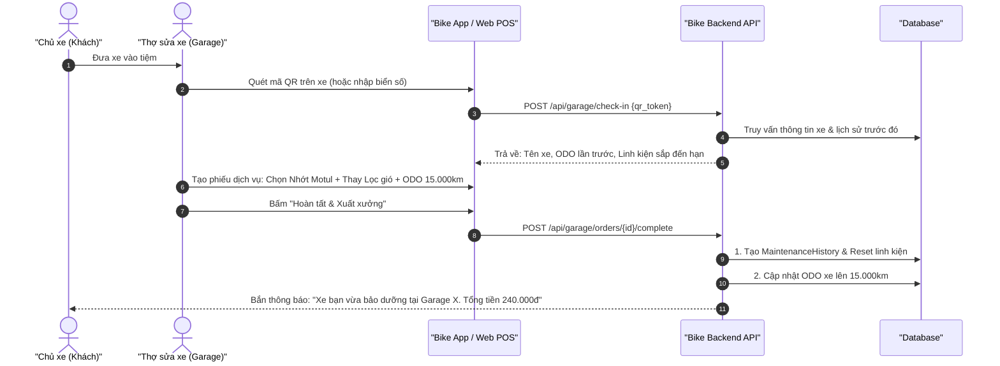

# Kế Hoạch Triển Khai: Kết Nối Garage & Thợ Sửa Xe Qua Mã QR, Đồng Bộ Lịch Sử & Nhắc Lịch CSKH (Garage QR Integration & CRM)

## 1. Tổng Quan & Giá Trị Thực Tế
* **Bài toán thực tế:**
  1. **Thợ sửa xe không có thời gian gõ dữ liệu:** Thợ tay dính dầu mỡ không thể ngồi gõ bàn phím tạo hồ sơ dài dòng. Khách hàng cũng ngại phải tự cập nhật sau mỗi lần sửa.
  2. **Tiệm sửa xe truyền thống mất khách:** Tiệm sửa xe nhỏ không có công cụ lưu giữ thông tin khách hàng (CRM). Sau khi thay nhớt, tiệm không có cách nào biết khi nào khách sắp đến kỳ thay nhớt tiếp theo để mời quay lại.
* **Giải pháp:**
  * **QR Check-in siêu tốc:** Mỗi xe có một mã QR (dán vào cốp xe / yếm xe hoặc mở từ app). Thợ chỉ cần dùng điện thoại quét 1 giây là biết ngay xe này lần trước đã làm gì, dùng nhớt loại nào.
  * **Phiếu dịch vụ 1 chạm (Quick Service Order):** Thợ tích chọn nhanh các gói bảo dưỡng (nhớt máy, nhớt lap, rửa xe, lọc gió...) -> Bấm "Hoàn tất" -> Hệ thống tự động đẩy lịch sử sang app của chủ xe.
  * **Hệ thống tái giữ chân khách hàng (Customer Retention CRM):** Garage có dashboard lọc các xe sắp đến hạn bảo dưỡng để tự động hoặc bấm gửi tin nhắn chăm sóc (Zalo ZNS / SMS) tặng kèm ưu đãi.

---

## 2. Thiết Kế Cơ Sở Dữ Liệu (Database Schema)
> [!IMPORTANT]
> **Quy tắc dự án:** Tuyệt đối không dùng foreign key constraints (`constrained()`, `foreign()`, `references()`). Dùng `unsignedBigInteger` cho các cột liên kết.

### 2.1. Bảng `bike_qr_codes` (Mã định danh dán trên xe)
* `id` (`bigIncrements`)
* `bike_id` (`unsignedBigInteger`): Liên kết đến xe.
* `qr_token` (`string`, unique): Mã token ngẫu nhiên bảo mật (Ví dụ: `QR-BK-9842F1`).
* `is_active` (`boolean`, default: true): Cho phép bật/tắt quét.
* `created_at`, `updated_at`

### 2.2. Bảng `garage_service_orders` (Phiếu dịch vụ tại tiệm)
* `id` (`bigIncrements`)
* `garage_id` (`unsignedBigInteger`): Liên kết đến bảng `garages`.
* `maintainer_id` (`unsignedBigInteger`): Nhân viên/thợ sửa thực hiện (`users.id`).
* `bike_id` (`unsignedBigInteger`): Xe được làm dịch vụ.
* `customer_id` (`unsignedBigInteger`, nullable): Chủ xe.
* `customer_phone` (`string`, nullable): Số điện thoại khách (nếu khách vãng lai chưa cài app).
* `order_code` (`string`, unique): Mã phiếu (Ví dụ: `SRV-202609-0012`).
* `service_odo` (`unsignedInteger`): ODO xe lúc tiếp nhận.
* `status` (`enum`: `received`, `in_progress`, `completed`, `cancelled`).
* `subtotal` (`unsignedDecimal:12,2`, default: 0).
* `discount` (`unsignedDecimal:12,2`, default: 0).
* `total_amount` (`unsignedDecimal:12,2`, default: 0).
* `synced_to_history` (`boolean`, default: false): Cờ đánh dấu đã chuyển vào `maintenance_histories`.
* `notes` (`text`, nullable): Ghi chú kỹ thuật của thợ (ví dụ: "Dây curoa có dấu hiệu nứt nhẹ, lần tới cần thay").
* `timestamps`

### 2.3. Bảng `garage_crm_campaigns` (Nhật ký nhắc bảo dưỡng CSKH)
* `id` (`bigIncrements`)
* `garage_id` (`unsignedBigInteger`)
* `bike_id` (`unsignedBigInteger`)
* `customer_id` (`unsignedBigInteger`, nullable)
* `channel` (`enum`: `zalo_zns`, `sms`, `push_notification`)
* `message_content` (`text`)
* `sent_at` (`timestamp`)
* `status` (`enum`: `sent`, `delivered`, `opened`, `failed`)
* `timestamps`

---

## 3. Quy Trình Phối Hợp Giữa Garage Và Chủ Xe (Workflow)

---

## 4. Danh Sách API Endpoints

### 4.1. Dành cho Garage & Thợ sửa xe
* `POST /api/garage/check-in`: Quét mã QR hoặc tìm theo biển số -> Trả về tóm tắt thông số kỹ thuật xe và lịch sử bảo dưỡng gần nhất.
* `POST /api/garage/orders`: Tạo mới một phiếu dịch vụ nhanh (quick ticket).
* `PUT /api/garage/orders/{id}/items`: Thêm/sửa danh sách linh kiện và dịch vụ trong phiếu.
* `POST /api/garage/orders/{id}/complete`: Nghiệm thu phiếu dịch vụ -> Tự động kích hoạt cơ chế đồng bộ sang tài khoản của chủ xe.
* `GET /api/garage/customers/due-maintenance`: Lấy danh sách các xe từng làm dịch vụ tại tiệm và đã đến hạn bảo dưỡng tiếp theo (dựa trên thuật toán ước tính ODO hoặc chu kỳ ngày).
* `POST /api/garage/customers/send-crm-reminder`: Gửi tin nhắn CSKH mời khách quay lại bảo dưỡng.

### 4.2. Dành cho Chủ xe
* `GET /api/bikes/{bikeId}/qr-code`: Lấy mã QR xe để in decal dán xe hoặc hiển thị mã trên app khi vào tiệm.
* `POST /api/bikes/{bikeId}/qr-code/regenerate`: Đổi mã QR mới trong trường hợp nghi ngờ mã cũ bị lộ.

---

## 5. Đặc Tả Use Case Chi Tiết Phục Vụ Kiểm Thử

### UC-GAR-01: Quét QR Check-in xe tại Garage
* **Actor:** Thợ sửa xe tại Garage.
* **Pre-condition:** Thợ đã đăng nhập tài khoản có quyền kỹ thuật viên của Garage, xe đã có mã QR dán trên yếm xe.
* **Main Flow:**
  1. Thợ mở camera trên app garage, quét mã QR dán trên xe.
  2. Hệ thống tìm thấy thông tin xe: *Honda Air Blade 2020 - Biển số 59-X1 234.56*.
  3. Màn hình thợ hiển thị bảng khuyến nghị nhanh:
     * *Lần trước (cách 2 tháng): Đã thay nhớt máy tại ODO 12.000 km.*
     * *Cảnh báo hiện tại: Đã đến hạn thay nhớt máy & kiểm tra lọc gió (dự kiến ODO ~14.000 km).*
  4. Thợ trao đổi nhanh với khách và bấm "Tạo phiếu dịch vụ".
* **Alternative Flow:**
  * Mã QR bị trầy xước không đọc được: Thợ chọn tab "Nhập biển số" để tra cứu thủ công.

### UC-GAR-02: Thợ tạo phiếu dịch vụ và tự động đồng bộ sang tài khoản chủ xe
* **Actor:** Thợ sửa xe & Chủ xe.
* **Pre-condition:** Phiếu dịch vụ đang ở trạng thái `in_progress`.
* **Main Flow:**
  1. Thợ chọn:
     * Dịch vụ 1: Nhớt Repsol Scooter 10W40 (140.000đ).
     * Dịch vụ 2: Lọc gió zin Honda (80.000đ).
     * Tiền công: 20.000đ.
     * ODO hiện tại: 14.150 km.
  2. Thợ chụp 1 tấm ảnh xe đã hoàn thiện xong.
  3. Thợ bấm nút "Hoàn thành & Bàn giao xe".
  4. Hệ thống thực hiện:
     * Cập nhật `garage_service_orders.status = completed`.
     * Tự động sinh bản ghi trong `maintenance_histories` gắn với `bike_id`.
     * Tự động cập nhật linh kiện nhớt và lọc gió trong `bike_components` về 100% Health.
     * Cập nhật ODO xe lên 14.150 km.
  5. Điện thoại chủ xe rung nhận thông báo: *"Bảo dưỡng hoàn tất tại Garage Hùng Cường. Chi tiết: Nhớt Repsol, Lọc gió. Tổng: 240.000đ"*.
* **Post-condition:** Cả hai bên đều lưu vết minh bạch mà chủ xe không cần tự gõ bất kỳ chữ nào.

### UC-GAR-03: Garage lọc khách hàng đến hạn và gửi nhắc lịch tự động
* **Actor:** Quản lý Garage.
* **Main Flow:**
  1. Quản lý vào mục "Chăm sóc khách hàng" trên Web Garage.
  2. Hệ thống liệt kê danh sách: Có 28 khách hàng đã sửa xe tại tiệm cách đây > 60 ngày hoặc ODO ước tính đã tăng thêm > 2.000 km.
  3. Quản lý chọn mẫu tin nhắn: *"Nhắc bảo dưỡng định kỳ - Tặng voucher giảm 10% tiền nhớt khi đặt hẹn trước"*.
  4. Quản lý bấm "Gửi nhắc nhở".
  5. Hệ thống gửi thông báo / Zalo ZNS tới danh sách khách hàng đủ điều kiện.
* **Post-condition:** Tạo bản ghi vào `garage_crm_campaigns`.

---

## 6. Ma Trận Kịch Bản Kiểm Thử (Test Cases Matrix)

| Test ID | Tên Kịch Bản | Dữ Liệu Đầu Vào | Kỳ Vọng Kết Quả | Phân Loại |
| :--- | :--- | :--- | :--- | :--- |
| **TC-GAR-Q01** | Quét mã QR hợp lệ | `qr_token` hợp lệ tồn tại trong CSDL | Trả về HTTP 200 kèm model xe, biển số, lịch sử 3 lần bảo dưỡng gần nhất. | Happy Path |
| **TC-GAR-Q02** | Quét mã QR đã bị vô hiệu hóa | `is_active = false` | Trả về HTTP 404/400 kèm thông báo "Mã QR xe này đã ngưng hoạt động". | Security Check |
| **TC-GAR-O01** | Tạo phiếu dịch vụ thành công | Garage ID, Bike ID, ODO = 15000, 2 items | Phiếu dịch vụ chuyển `completed`, tạo thành công `maintenance_histories`. | Integration |
| **TC-GAR-O02** | Đồng bộ tự động sang linh kiện chủ xe | Thay phụ tùng có `category_key = 'engine_oil'` | Linh kiện nhớt máy của xe tự động reset ODO lắp đặt về 15.000 km. | Sync Integrity |
| **TC-GAR-O03** | Khách vãng lai chưa có tài khoản app | Khách chỉ cung cấp số điện thoại `0912345678` | Hệ thống lưu phiếu theo số điện thoại; khi khách đăng ký app bằng SĐT này sau đó sẽ tự động liên kết lịch sử. | Edge Case |
| **TC-GAR-C01** | Phân quyền Garage (Tenant Isolation) | Garage A cố gắng xem đơn dịch vụ của Garage B | Báo lỗi 403 Forbidden, không cho phép đọc chéo dữ liệu tiệm khác. | Authorization |

---

## 7. Kế Hoạch Triển Khai
1. Tạo migration `bike_qr_codes`, `garage_service_orders`, `garage_crm_campaigns` (không dùng foreign key constraint).
2. Tạo logic sinh token QR duy nhất (`Str::random(16)`) khi tạo xe mới.
3. Viết `GarageCheckinService` và `GarageOrderService` đồng bộ hai chiều giữa thợ và chủ xe.
4. Tích hợp kênh thông báo (Database Notification & Zalo ZNS API).
