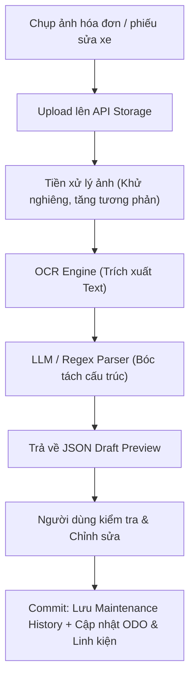
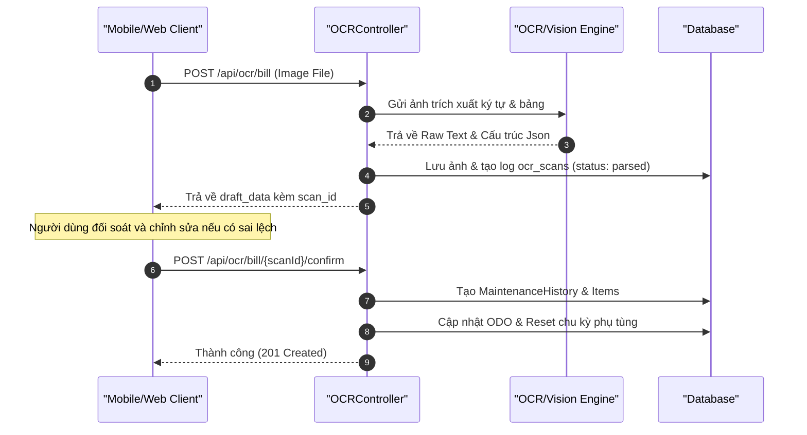

# Kế Hoạch Triển Khai: Nhận Diện Biển Số & Bóc Tách Hóa Đơn Bảo Dưỡng Bằng OCR (AI Plate & Bill Scanner)

## 1. Tổng Quan & Giá Trị Thực Tế
* **Bài toán thực tế:**
  1. **Ngại nhập chi tiết hóa đơn:** Sau khi bảo dưỡng, tiệm sửa xe thường đưa một phiếu tính tiền gồm nhiều món (nhớt máy 130k, lọc gió 80k, công thay 30k, thay má phanh 120k...). Người dùng rất lười gõ từng dòng vào ứng dụng.
  2. **Tìm kiếm xe chậm:** Tại các garage hoặc chủ sở hữu nhiều xe, việc chọn đúng biển số từ danh sách thủ công gây mất thời gian.
* **Giải pháp:**
  * **Nhận diện biển số xe máy Việt Nam (Plate OCR):** Chụp ảnh đuôi xe để trích xuất chuẩn xác biển kiểm soát (cả biển 4 số cũ lẫn 5 số mới, biển 1 dòng hoặc 2 dòng dạng `29-E1 123.45`, `59-X3 888.88`).
  * **Bóc tách hóa đơn bảo dưỡng (Receipt/Bill OCR):** Tích hợp xử lý ảnh và trích xuất cấu trúc (Vision LLM / Document OCR) để tự động nhận dạng: *Tên gara, Ngày bảo dưỡng, Số ODO ghi trên phiếu, Danh sách phụ tùng + số lượng + đơn giá, và Tổng tiền*.
  * **Cơ chế Human-in-the-loop (Xem lại & Xác nhận):** Dữ liệu OCR hiển thị dưới dạng bản nháp để người dùng kiểm tra, chỉnh sửa nhanh 1 chạm trước khi lưu vào CSDL.

---

## 2. Thiết Kế Cơ Sở Dữ Liệu (Database Schema)
> [!IMPORTANT]
> **Quy tắc dự án:** Tuyệt đối không dùng foreign key constraints (`constrained()`, `foreign()`, `references()`). Dùng `unsignedBigInteger` cho các cột liên kết.

### 2.1. Bảng `ocr_scans`
Lưu trữ log quét và dữ liệu thô nhận diện:
* `id` (`bigIncrements`)
* `user_id` (`unsignedBigInteger`): Người thực hiện quét.
* `bike_id` (`unsignedBigInteger`, nullable): Xe được gán (nếu xác định được).
* `scan_type` (`enum`: `license_plate`, `receipt_bill`).
* `image_path` (`string`): Đường dẫn ảnh lưu trữ trong Storage.
* `raw_text` (`text`, nullable): Chuỗi text thô nhận diện từ OCR.
* `parsed_data` (`json`, nullable): Dữ liệu có cấu trúc sau khi bóc tách (Gara, ODO, Items, Total...).
* `confidence_score` (`decimal:5,2`, nullable): Độ tin cậy (0 - 100%).
* `status` (`enum`: `pending`, `parsed`, `confirmed`, `rejected`): Trạng thái xử lý.
* `timestamps`

### 2.2. Bảng `maintenance_items` (Chi tiết từng món trong đợt bảo dưỡng)
Bổ sung bảng phân rã chi tiết cho `maintenance_histories` hiện tại:
* `id` (`bigIncrements`)
* `maintenance_history_id` (`unsignedBigInteger`): Liên kết đến bảng `maintenance_histories`.
* `item_name` (`string`): Tên phụ tùng hoặc dịch vụ (Ví dụ: "Nhớt Castrol Power1 10W40", "Công vệ sinh nồi").
* `category_key` (`string`, nullable): Ánh xạ đến linh kiện (`engine_oil`, `air_filter`...).
* `quantity` (`unsignedSmallInteger`, default: 1).
* `unit_price` (`unsignedDecimal:12,2`, default: 0).
* `subtotal` (`unsignedDecimal:12,2`, default: 0).
* `is_part_replacement` (`boolean`, default: true): Đánh dấu là thay phụ tùng hay tiền công dịch vụ.
* `timestamps`

---

## 3. Thiết Kế Kỹ Thuật & Kiến Trúc Xử Lý

### 3.1. Pipeline bóc tách hóa đơn bảo dưỡng

### 3.2. Chuẩn hóa định dạng biển số xe Việt Nam (Plate Normalization)
* Regex kiểm tra biển số xe máy: `^(\d{2})[- ]?([A-Z]{1,2}\d|\d[A-Z]{1,2})[- ]?(\d{4}|\d{3}\.\d{2})$`
* Ví dụ hợp lệ:
  * `59-P1 888.88` -> Chuẩn hóa: `59P1-88888`
  * `29-E2 123.45` -> Chuẩn hóa: `29E2-12345`

### 3.3. Danh Sách API Endpoints
* `POST /api/ocr/plate`: Tải ảnh chụp biển số -> Trả về chuỗi biển số chuẩn hóa + gợi ý `bike_id` tương ứng trong tài khoản nếu đã có.
* `POST /api/ocr/bill`: Tải ảnh chụp hóa đơn bảo dưỡng -> Trả về `scan_id` và dữ liệu nháp cấu trúc (`garage_name`, `date`, `odometer`, `items[]`, `total_amount`).
* `PUT /api/ocr/bill/{scanId}`: Cập nhật chỉnh sửa của người dùng đối với bản nháp trước khi lưu.
* `POST /api/ocr/bill/{scanId}/confirm`: Xác nhận lưu bản nháp vào hệ thống:
  1. Tạo bản ghi `maintenance_histories` & `maintenance_items`.
  2. Cập nhật ODO xe nếu ODO trên phiếu lớn hơn ODO hiện tại.
  3. Reset chu kỳ các linh kiện tương ứng trong `bike_components`.

---

## 4. Đặc Tả Use Case Chi Tiết Phục Vụ Kiểm Thử

### UC-OCR-01: Quét biển số xe tự động nhận diện xe
* **Actor:** Chủ xe hoặc Thợ tại Garage.
* **Pre-condition:** Camera có quyền truy cập, biển số xe không bị bùn đất che khuất hoàn toàn.
* **Main Flow:**
  1. Người dùng bấm nút "Quét biển số" trên app.
  2. Camera chụp ảnh biển số xe sau đuôi.
  3. Hệ thống gửi ảnh tới `POST /api/ocr/plate`.
  4. Hệ thống trích xuất biển số `59-K1 456.78` và tìm trong CSDL.
  5. Nếu tìm thấy xe thuộc về user: Tự động chuyển tới màn hình chi tiết chiếc xe đó.
  6. Nếu không tìm thấy: Hiển thị form tạo mới xe với biển số đã điền sẵn.
* **Alternative/Exception Flow:**
  * Ảnh chụp quá tối hoặc rung mờ: Hệ thống báo lỗi *"Không nhận diện được biển số. Vui lòng chụp rõ nét hơn hoặc nhập tay"*.

### UC-OCR-02: Bóc tách hóa đơn sửa xe tự động (Receipt Scan)
* **Actor:** Chủ xe.
* **Pre-condition:** Có hóa đơn giấy hoặc phiếu bảo dưỡng có chữ in rõ ràng.
* **Main Flow:**
  1. Người dùng vào mục "Thêm lịch sử bảo dưỡng" -> Chọn "Chụp phiếu tính tiền".
  2. Hệ thống tải ảnh lên, phân tích OCR và trả về bản nháp gồm:
     * Ngày sửa: `28/09/2026`
     * ODO ghi nhận: `15.420 km`
     * Món 1: "Nhớt xe ga Motul Scooter Expert" - 160.000đ
     * Món 2: "Lọc gió Air Blade 125" - 90.000đ
     * Tổng tiền: 250.000đ
  3. Người dùng thấy toàn bộ dữ liệu được điền vào form xem trước.
  4. Người dùng bấm "Xác nhận & Lưu".
* **Post-condition:** Bản ghi bảo dưỡng được tạo thành công, linh kiện nhớt máy và lọc gió được tự động đánh dấu đã thay mới.

### UC-OCR-03: Người dùng chỉnh sửa dữ liệu nhận diện sai (Human-in-the-loop Correction)
* **Actor:** Chủ xe.
* **Pre-condition:** Phiếu in nhiệt bị mờ, OCR nhận diện sai một số dòng.
* **Main Flow:**
  1. Hệ thống bóc tách hóa đơn, nhận diện sai giá tiền món số 2 thành 900.000đ thay vì 90.000đ.
  2. Trên giao diện preview, người dùng bấm vào dòng số 2, sửa lại thành 90.000đ.
  3. Hệ thống tự động tính lại tổng tiền.
  4. Người dùng bấm "Lưu".
* **Post-condition:** Dữ liệu chuẩn xác được ghi vào DB.

---

## 5. Sơ Đồ Tuần Tự (Sequence Diagram)

---

## 6. Ma Trận Kịch Bản Kiểm Thử (Test Cases Matrix)

| Test ID | Tên Kịch Bản | Dữ Liệu Đầu Vào | Kỳ Vọng Kết Quả | Phân Loại |
| :--- | :--- | :--- | :--- | :--- |
| **TC-OCR-P01** | Nhận diện biển số 5 chữ số tiêu chuẩn | Ảnh chụp biển `59-F2 789.10` rõ nét | Nhận diện chính xác chuỗi `59F278910`, confidence $\ge 90\%$. | Happy Path |
| **TC-OCR-P02** | Nhận diện biển số 4 chữ số đời cũ | Ảnh chụp biển `29-H4 5678` | Nhận diện chính xác chuỗi `29H45678`. | Regression |
| **TC-OCR-P03** | Ảnh chụp không có biển số | Ảnh chụp yên xe hoặc mặt đất | Trả về thông báo lỗi 400 "Không phát hiện biển số trong ảnh". | Error Handling |
| **TC-OCR-B01** | Bóc tách hóa đơn in nhiệt đầy đủ | Ảnh chụp phiếu sửa xe gồm 3 hạng mục phụ tùng | Bóc tách đúng ngày, ODO, 3 items và tổng tiền khớp với hóa đơn. | Integration |
| **TC-OCR-B02** | Xử lý ngày hóa đơn không hợp lệ | Hóa đơn bị nhận diện nhầm năm sang `2035` | Bộ lọc validation cảnh báo "Ngày bảo dưỡng không thể ở tương lai". | Validation |
| **TC-OCR-B03** | Khớp phụ tùng tự động (Part Mapping) | Tên trên phiếu: "Thay nhớt hộp số xe ga" | Ánh xạ chính xác tới `category_key = 'gear_oil'`. | Logic Test |
| **TC-OCR-B04** | Confirm tạo lịch sử bảo dưỡng | Gửi request confirm scan ID hợp lệ | Tạo 1 `maintenance_histories`, 3 `maintenance_items`, reset ODO xe. | End-to-End |

---

## 7. Kế Hoạch Triển Khai
1. Nâng cấp `PlateController.php` hiện tại để lưu log và tích hợp chuẩn hóa regex cho biển số Việt Nam.
2. Tích hợp Provider OCR hóa đơn (sử dụng Vision API với Structured Output schema).
3. Tạo migration cho `ocr_scans` và `maintenance_items` (tuân thủ quy tắc không dùng foreign key constraint).
4. Viết Service `ReceiptParserService` để ánh xạ danh mục phụ tùng tự động.
