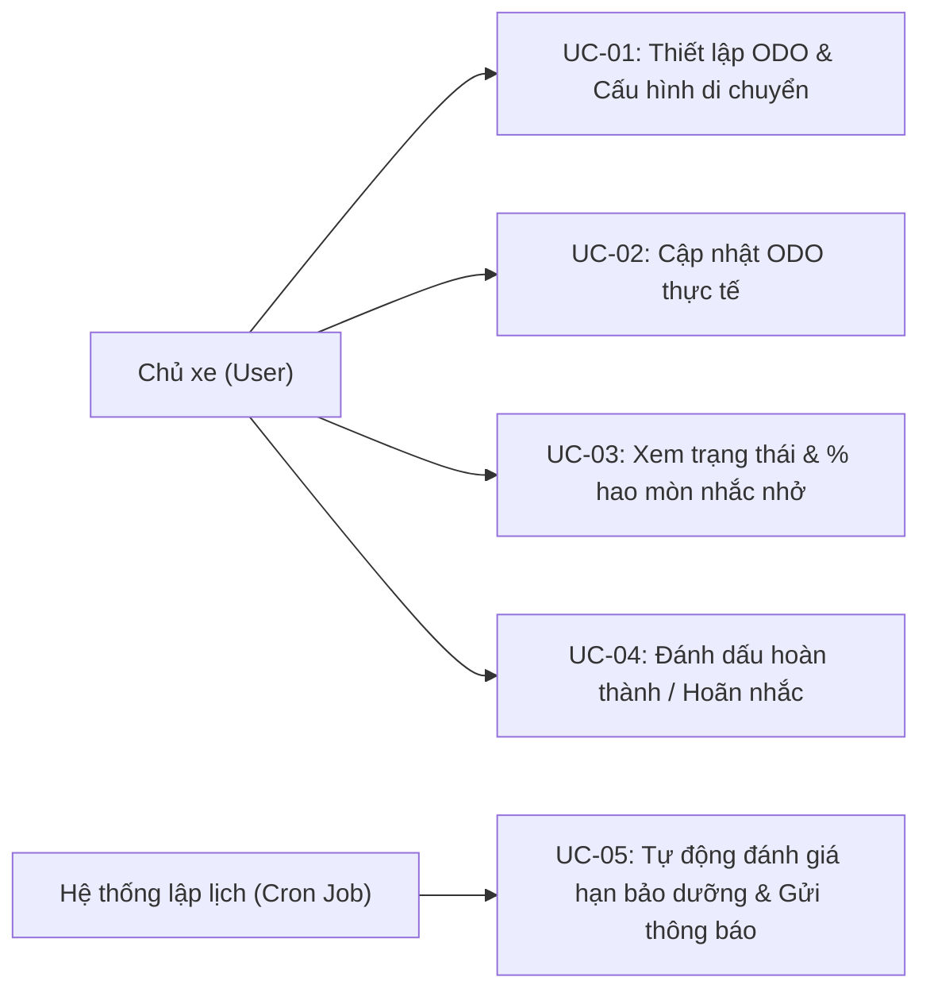
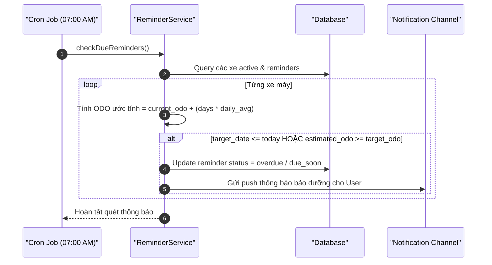

# Kế Hoạch Triển Khai: Dự Đoán ODO Tự Động & Nhắc Bảo Dưỡng Kép (Smart ODO & Dual Reminder)

## 1. Tổng Quan & Giá Trị Thực Tế
* **Bài toán thực tế:** Người dùng xe máy thường không nhớ số km (ODO) hiện tại và rất ngại mở ứng dụng chỉ để gõ số km mỗi ngày. Do đó, các thông báo nhắc bảo dưỡng cố định thường bị bỏ lỡ hoặc nhắc sai thời điểm.
* **Giải pháp:**
  * **Thuật toán ước tính ODO tự động (ODO Estimation):** Cho phép người dùng nhập mức di chuyển ước lượng hàng ngày (ví dụ 15 km/ngày) hoặc hệ thống tự động suy diễn từ các lần cập nhật ODO lịch sử. Hệ thống tự động tịnh tiến ODO theo thời gian thực.
  * **Cơ chế nhắc kép (Dual-Trigger Rule):** Kiểm tra đồng thời cả 2 điều kiện: **Số Km** hoặc **Số Ngày** (Điều kiện nào đến trước sẽ kích hoạt cảnh báo).
  * **Đa kênh thông báo:** In-app Notification, Push Notification và mở rộng qua Zalo ZNS / Webhook.

---

## 2. Thiết Kế Cơ Sở Dữ Liệu (Database Schema)
> [!IMPORTANT]
> **Quy tắc dự án:** Tuyệt đối không dùng foreign key constraints (`constrained()`, `foreign()`, `references()`). Dùng `unsignedBigInteger` cho các cột liên kết. Quan hệ được định nghĩa qua Eloquent Model.

### 2.1. Cập nhật bảng `bikes`
Thêm các trường phục vụ ước tính ODO vào bảng `bikes`:
* `current_odo` (`unsignedInteger`): Mốc ODO thực tế được xác nhận gần nhất.
* `last_odo_date` (`date`): Ngày ghi nhận mốc `current_odo`.
* `daily_avg_km` (`unsignedDecimal:8,2`, default: 15.00): Số km di chuyển trung bình ước tính mỗi ngày.
* `is_auto_estimate` (`boolean`, default: true): Bật/tắt chế độ tự động tính ODO.

### 2.2. Bảng `bike_odo_logs`
Lưu lại lịch sử các lần cập nhật ODO thực tế để phục vụ thuật toán học máy / tính toán trung bình:
* `id` (`bigIncrements`)
* `bike_id` (`unsignedBigInteger`): ID của xe.
* `logged_odo` (`unsignedInteger`): Số km ghi nhận.
* `logged_date` (`date`): Ngày ghi nhận.
* `source` (`string`): Nguồn (`manual`, `maintenance_record`, `bill_ocr`, `fuel_log`).
* `notes` (`string`, nullable): Ghi chú.
* `timestamps`

### 2.3. Bảng `maintenance_reminders`
Lưu trữ các mục tiêu bảo dưỡng cần nhắc nhở:
* `id` (`bigIncrements`)
* `bike_id` (`unsignedBigInteger`)
* `category_key` (`string`): Mã hạng mục (`engine_oil`, `gear_oil`, `spark_plug`, `air_filter`, `coolant`, `brake_fluid`, `drive_belt_chain`, `tire`).
* `title` (`string`): Tên nhắc nhở (Ví dụ: "Thay nhớt máy định kỳ").
* `last_service_odo` (`unsignedInteger`): ODO tại lần làm gần nhất.
* `last_service_date` (`date`): Ngày làm gần nhất.
* `interval_km` (`unsignedInteger`, nullable): Chu kỳ theo km (ví dụ: 2000).
* `interval_days` (`unsignedInteger`, nullable): Chu kỳ theo ngày (ví dụ: 90).
* `target_odo` (`unsignedInteger`, nullable): Mốc km cần nhắc (= `last_service_odo` + `interval_km`).
* `target_date` (`date`, nullable): Mốc ngày cần nhắc (= `last_service_date` + `interval_days`).
* `status` (`enum`: `active`, `due_soon`, `overdue`, `completed`, `snoozed`): Trạng thái nhắc.
* `notified_at` (`timestamp`, nullable): Thời điểm đã gửi thông báo gần nhất.
* `snooze_until` (`date`, nullable): Hoãn nhắc nhở đến ngày.
* `timestamps`

---

## 3. Thiết Kế Kỹ Thuật & API Endpoints

### 3.1. Thuật toán ước tính ODO (ODO Calculation Service)
Công thức tính ODO ước tính tại ngày $T_{now}$:
$$ODO_{estimated} = ODO_{last} + \max(0, (Date_{now} - Date_{last})) \times DailyAvgKm$$

Khi có ít nhất 2 mốc `bike_odo_logs` cách nhau $\ge 7$ ngày, hệ thống tự động cập nhật lại `daily_avg_km`:
$$DailyAvgKm_{new} = \frac{ODO_{log\_2} - ODO_{log\_1}}{Date_{log\_2} - Date_{log\_1}}$$

### 3.2. Danh Sách API Endpoints
* `GET /api/bikes/{bikeId}/odo`: Lấy thông tin ODO thực tế + ODO ước tính hiện tại + trạng thái bảo dưỡng.
* `POST /api/bikes/{bikeId}/odo`: Cập nhật ODO thực tế mới (tạo log trong `bike_odo_logs` và tái tính toán reminder).
* `PUT /api/bikes/{bikeId}/odo-settings`: Cập nhật `daily_avg_km` và bật/tắt `is_auto_estimate`.
* `GET /api/bikes/{bikeId}/reminders`: Danh sách các mục bảo dưỡng và tiến độ (% hao mòn).
* `POST /api/reminders/{reminderId}/snooze`: Hoãn nhắc nhở (thêm 3 ngày hoặc 7 ngày).
* `POST /api/reminders/{reminderId}/complete`: Đánh dấu đã hoàn thành và thiết lập chu kỳ mới.

### 3.3. Scheduled Console Job (Cronjob)
* Command: `php artisan bike:check-due-reminders`
* Tần suất: Chạy mỗi ngày vào lúc 07:00 sáng.
* Logic:
  1. Lấy danh sách các xe có `is_auto_estimate = true`.
  2. Tính ODO ước tính hiện tại.
  3. So sánh với `target_odo` và `target_date`.
  4. Nếu ODO còn $\le 100\text{ km}$ hoặc ngày còn $\le 5\text{ ngày}$ -> Đặt trạng thái `due_soon`.
  5. Nếu vượt quá -> Đặt `overdue`.
  6. Gửi Notification tương ứng cho `user_id` sở hữu xe.

---

## 4. Sơ Đồ Use Case & Luồng Hoạt Động (Workflows)

### 4.1. Sơ đồ Use Case tổng thể

### 4.2. Luồng kích hoạt nhắc nhở kép (Sequence Diagram)

---

## 5. Đặc Tả Use Case Chi Tiết Phục Vụ Kiểm Thử

### UC-01: Thiết lập cấu hình di chuyển & Ước tính ODO ban đầu
* **Actor:** Chủ xe.
* **Pre-condition:** Xe đã được tạo trong hệ thống.
* **Main Flow:**
  1. Người dùng vào màn hình cài đặt xe, nhập ODO ban đầu (ví dụ: 12.000 km) và ngày ghi nhận.
  2. Người dùng nhập số km dự kiến đi mỗi ngày (ví dụ: 20 km/ngày).
  3. Hệ thống lưu `current_odo = 12000`, `daily_avg_km = 20`.
  4. Hệ thống tự động tạo các bản ghi `maintenance_reminders` mặc định theo hãng xe (nhớt máy 14.000 km, nhớt lap 16.000 km...).
* **Post-condition:** ODO ước tính của các ngày tiếp theo tự động tăng `+20 km/ngày`.

### UC-02: Cập nhật ODO thực tế (Correction Flow)
* **Actor:** Chủ xe.
* **Pre-condition:** Đã có ODO ước tính đang chạy.
* **Main Flow:**
  1. Người dùng mở app, nhập ODO hiển thị trên đồng hồ xe thực tế (ví dụ: 12.500 km).
  2. Hệ thống kiểm tra: ODO mới phải $\ge$ `current_odo` cũ.
  3. Hệ thống lưu một log mới vào `bike_odo_logs`.
  4. Hệ thống tính lại `daily_avg_km` mới nếu đủ điều kiện khoảng cách ngày.
  5. Hệ thống tái đánh giá lại mốc `target_odo` của các nhắc nhở đang chờ.
* **Alternative/Exception Flow:**
  * Nếu ODO mới $<$ `current_odo` cũ: Hệ thống hiển thị cảnh báo lỗi: *"Số ODO mới không thể nhỏ hơn số ODO đã ghi nhận trước đó"*.

### UC-03: Kích hoạt cảnh báo nhắc nhở kép (Km đến trước hoặc Ngày đến trước)
* **Actor:** Hệ thống (Cron job).
* **Main Flow (Trường hợp 1 - Km chạm trước):**
  * Xe đi nhiều: `target_odo = 15.000 km`, `target_date = 01/12/2026`.
  * Hôm nay là `15/10/2026`, ODO ước tính chạm `15.010 km`.
  * Hệ thống kích hoạt nhắc nhở: *"Xe của bạn đã đến mốc 15.000 km, cần thay nhớt máy"*.
* **Main Flow (Trường hợp 2 - Ngày chạm trước):**
  * Xe ít đi: `target_odo = 15.000 km`, `target_date = 01/12/2026`.
  * Hôm nay là `01/12/2026`, ODO ước tính mới chỉ `13.500 km`.
  * Hệ thống kích hoạt nhắc nhở: *"Đã 3 tháng kể từ lần thay nhớt trước, hãy kiểm tra nhớt máy dù chưa đủ số km"*.

---

## 6. Ma Trận Kịch Bản Kiểm Thử (Test Cases Matrix)

| Test ID | Tên Kịch Bản | Dữ Liệu Đầu Vào | Kỳ Vọng Kết Quả | Phân Loại |
| :--- | :--- | :--- | :--- | :--- |
| **TC-ODO-01** | Tính ODO ước tính sau N ngày | `current_odo = 10000`, `daily_avg_km = 20`, cách 5 ngày | ODO ước tính trả về `10100 km`. | Happy Path |
| **TC-ODO-02** | Chặn nhập ODO mới nhỏ hơn ODO cũ | ODO cũ: `10500`. Nhập ODO mới: `10400` | HTTP 422 Unprocessable Entity, báo lỗi không hợp lệ. | Validation |
| **TC-ODO-03** | Tự tính lại `daily_avg_km` thông minh | Log 1: 10.000 km ngày 01/01. Log 2: 10.300 km ngày 11/01 (10 ngày) | `daily_avg_km` cập nhật thành 30 km/ngày. | Logic Check |
| **TC-REM-01** | Kích hoạt nhắc nhở khi chạm mốc KM | ODO ước tính = 11.950 km, `target_odo = 12.000 km` ($\le 100\text{km}$) | Reminder chuyển sang `due_soon`, notification được tạo. | Boundary Test |
| **TC-REM-02** | Kích hoạt nhắc nhở khi chạm mốc Ngày trước Km | Còn thiếu 1.000 km nhưng `target_date` chỉ còn 2 ngày | Reminder chuyển sang `due_soon` do điều kiện ngày thỏa mãn. | Business Rule |
| **TC-REM-03** | Hoãn nhắc nhở (Snooze Reminder) | Bấm hoãn 7 ngày khi đang bị nhắc | Reminder chuyển `snoozed`, không gửi lại thông báo trong 7 ngày tới. | State Transition |
| **TC-REM-04** | Đánh dấu hoàn thành nhắc nhở | Bấm "Đã thay nhớt" tại ODO 12.050 km | Reminder cũ thành `completed`, tạo reminder chu kỳ mới với `last_service_odo = 12050`. | Cycle Reset |

---

## 7. Kế Hoạch Triển Khai (Roadmap)
1. **Giai đoạn 1 (Backend Database & Service):**
   * Tạo migration cho `bike_odo_logs`, bổ sung fields vào `bikes`, tạo `maintenance_reminders` (chú ý: không dùng foreign key constraint).
   * Viết `OdoCalculationService` và Unit Test các công thức toán.
2. **Giai đoạn 2 (API & Scheduled Job):**
   * Xây dựng controller và request validation.
   * Viết command `CheckDueRemindersCommand` và cấu hình trong `routes/console.php`.
3. **Giai đoạn 3 (Testing & Tinh Chỉnh):**
   * Thực thi toàn bộ test cases trong ma trận.
   * Đảm bảo tính toán đúng múi giờ `Asia/Ho_Chi_Minh`.
