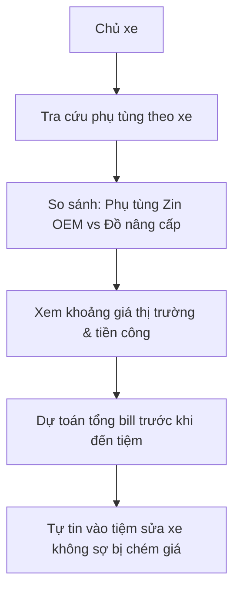

# Kế Hoạch Triển Khai: Tra Cứu Phụ Tùng Tương Thích & Bảng Giá Thị Trường Tham Khảo (Parts Catalog & Price Benchmark)

## 1. Tổng Quan & Giá Trị Thực Tế
* **Bài toán thực tế:**
  1. **Nỗi sợ bị "vẽ bệnh" và "chém giá":** Khi vào tiệm sửa xe lạ, người dùng không biết mức giá phụ tùng thông thường là bao nhiêu (ví dụ: bình ắc quy 350k hay 650k, nhớt 120k hay 250k).
  2. **Mua nhầm thông số phụ tùng:** Mỗi dòng xe có tiêu chuẩn kỹ thuật riêng biệt. Ví dụ: Honda Vision dùng nhớt 0.7L - 0.8L (nếu đổ chai 1.0L sẽ bị nặng máy, ì xe); bugi chân dài khác chân ngắn; lốp xe trước sau khác thông số vành.
* **Giải pháp:**
  * **Hệ thống gợi ý phụ tùng chuẩn theo xe (Compatibility Engine):** Dựa trên `brand_id` và dòng xe trong hồ sơ, tự động lọc và gợi ý các phụ tùng OEM (chính hãng) và Aftermarket (độ/thay thế) tương thích 100%.
  * **Bảng giá thị trường tham khảo (Reference Price Benchmark):** Hiển thị khoảng giá phổ biến tại các đại lý chính hãng và tiệm sửa chữa để người dùng tự tin đối soát trước khi đồng ý thay thế.
  * **Dự toán chi phí bảo dưỡng (Cost Estimator):** Cho phép người dùng chọn các món muốn làm để xem trước ước tính tổng chi phí (tiền đồ + tiền công dự kiến).

---

## 2. Thiết Kế Cơ Sở Dữ Liệu (Database Schema)
> [!IMPORTANT]
> **Quy tắc dự án:** Tuyệt đối không dùng foreign key constraints (`constrained()`, `foreign()`, `references()`). Dùng `unsignedBigInteger` cho các cột liên kết.

### 2.1. Bảng `bike_part_compatibilities` (Ánh xạ tương thích phụ tùng và dòng xe)
* `id` (`bigIncrements`)
* `bike_model_id` (`unsignedBigInteger`): Liên kết đến `bike_models`.
* `bike_part_id` (`unsignedBigInteger`): Liên kết đến `bike_parts`.
* `product_id` (`unsignedBigInteger`, nullable): Liên kết đến `products` (nếu có sản phẩm cụ thể).
* `is_oem` (`boolean`, default: false): Phụ tùng chính hãng hay đồ thay thế ngoài.
* `specification_note` (`string`, nullable): Ví dụ: "Dung tích 0.8L, chân bugi dài ren 10mm".
* `recommended_replace_km` (`unsignedInteger`, nullable): Chu kỳ khuyến nghị.
* `timestamps`

### 2.2. Bảng `part_price_benchmarks` (Khoảng giá tham khảo thị trường)
* `id` (`bigIncrements`)
* `bike_part_id` (`unsignedBigInteger`)
* `min_price` (`unsignedDecimal:12,2`): Giá sàn thị trường.
* `max_price` (`unsignedDecimal:12,2`): Giá trần phổ biến.
* `avg_labor_cost` (`unsignedDecimal:12,2`, default: 0): Tiền công thợ ước tính (VND).
* `price_source` (`string`, default: 'market_survey'): Nguồn khảo sát giá.
* `last_updated_at` (`date`)
* `timestamps`

---

## 3. Danh Sách API Endpoints

* `GET /api/bikes/{bikeId}/parts/recommendations`: Gợi ý toàn bộ phụ tùng tương thích theo đúng thông số của xe đang sở hữu.
* `GET /api/parts/search`: Tra cứu phụ tùng theo tên, danh mục (`bike_part_categories`), hoặc dòng xe.
* `GET /api/parts/{partId}/price-benchmark`: Lấy khoảng giá tham khảo (Giá linh kiện + Tiền công thay dự kiến).
* `POST /api/parts/estimate-service`: Gửi danh sách các mã phụ tùng dự kiến thay -> Trả về tổng chi phí ước tính tối thiểu và tối đa.

---

## 4. Sơ Đồ Use Case & Luồng Hoạt Động (Workflows)

---

## 5. Đặc Tả Use Case Chi Tiết Phục Vụ Kiểm Thử

### UC-PRT-01: Gợi ý phụ tùng tương thích theo xe người dùng
* **Actor:** Chủ xe.
* **Pre-condition:** Người dùng sở hữu xe Honda Winner X 150 (có `bike_model_id = 4`).
* **Main Flow:**
  1. Người dùng bấm vào mục "Phụ tùng chuẩn cho xe của tôi".
  2. Hệ thống tìm kiếm trong bảng `bike_part_compatibilities` theo `bike_model_id = 4`.
  3. Màn hình trả về danh sách được nhóm theo danh mục:
     * Nhớt máy: Yêu cầu dung tích 1.1L (thay lọc) - 1.2L (rã máy), cấp nhớt MA2 10W40.
     * Bugi: NGK Laser Iridium chân dài CPR9EA-9.
     * Nhông sên dĩa: Thông số 15T - 44T, sên 428 (122 mắt).
* **Post-condition:** Người dùng biết chính xác thông số chuẩn khi đi mua hoặc kiểm tra thợ lắp.

### UC-PRT-02: Xem khoảng giá tham khảo và cảnh báo giá bất thường
* **Actor:** Chủ xe.
* **Pre-condition:** Đang ở tiệm sửa xe, thợ báo giá thay bình ắc quy là 600.000đ.
* **Main Flow:**
  1. Người dùng mở app, tìm "Bình ắc quy GS 12V-5Ah".
  2. Hệ thống hiển thị:
     * Khoảng giá linh kiện: 280.000đ - 350.000đ.
     * Tiền công thợ thông thường: 20.000đ - 30.000đ.
     * Tổng hợp lý: 300.000đ - 380.000đ.
  3. Người dùng nhận biết mức giá 600.000đ của tiệm đang cao bất thường so với mặt bằng thị trường để đàm phán hoặc lựa chọn tiệm khác.

---

## 6. Ma Trận Kịch Bản Kiểm Thử (Test Cases Matrix)

| Test ID | Tên Kịch Bản | Dữ Liệu Đầu Vào | Kỳ Vọng Kết Quả | Phân Loại |
| :--- | :--- | :--- | :--- | :--- |
| **TC-PRT-01** | Lấy phụ tùng tương thích theo đúng xe | `bike_id` của xe Lead 125 | Trả về các món tương thích Lead (nhớt 0.8L, sên không có, có dây curoa). | Filter Test |
| **TC-PRT-02** | Dòng xe không có dữ liệu tương thích | Xe cổ hoặc dòng hiếm chưa nhập dữ liệu | Trả về danh sách trống kèm thông báo "Chưa có thông số tương thích cho dòng xe này". | Edge Case |
| **TC-PRT-03** | Dự toán tổng chi phí combo bảo dưỡng | Chọn 3 món: Nhớt (150k), Lọc gió (90k), Bugi (80k), Công (50k) | Tổng dự toán trả về: 370.000đ chính xác. | Math Test |
| **TC-PRT-04** | Tìm kiếm phụ tùng không phân biệt hoa thường | Tìm từ khóa: "motul", "MOTUL", "Motul" | Trả về cùng một danh sách kết quả phù hợp. | Search Query |

---

## 7. Kế Hoạch Triển Khai
1. Tạo migration `bike_part_compatibilities` và `part_price_benchmarks` (không dùng foreign key constraint).
2. Viết command import dữ liệu thông số tương thích chuẩn cho các dòng xe phổ biến tại Việt Nam.
3. Xây dựng API tra cứu và bộ lọc theo dòng xe.
